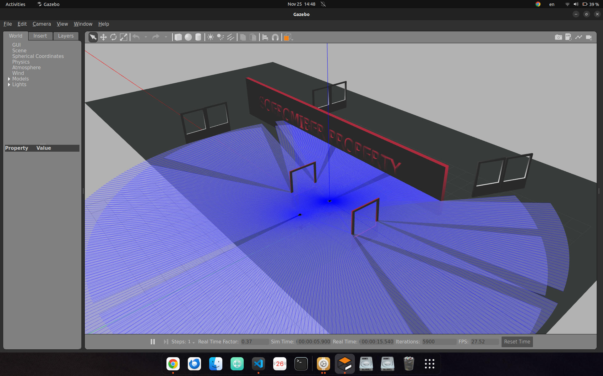
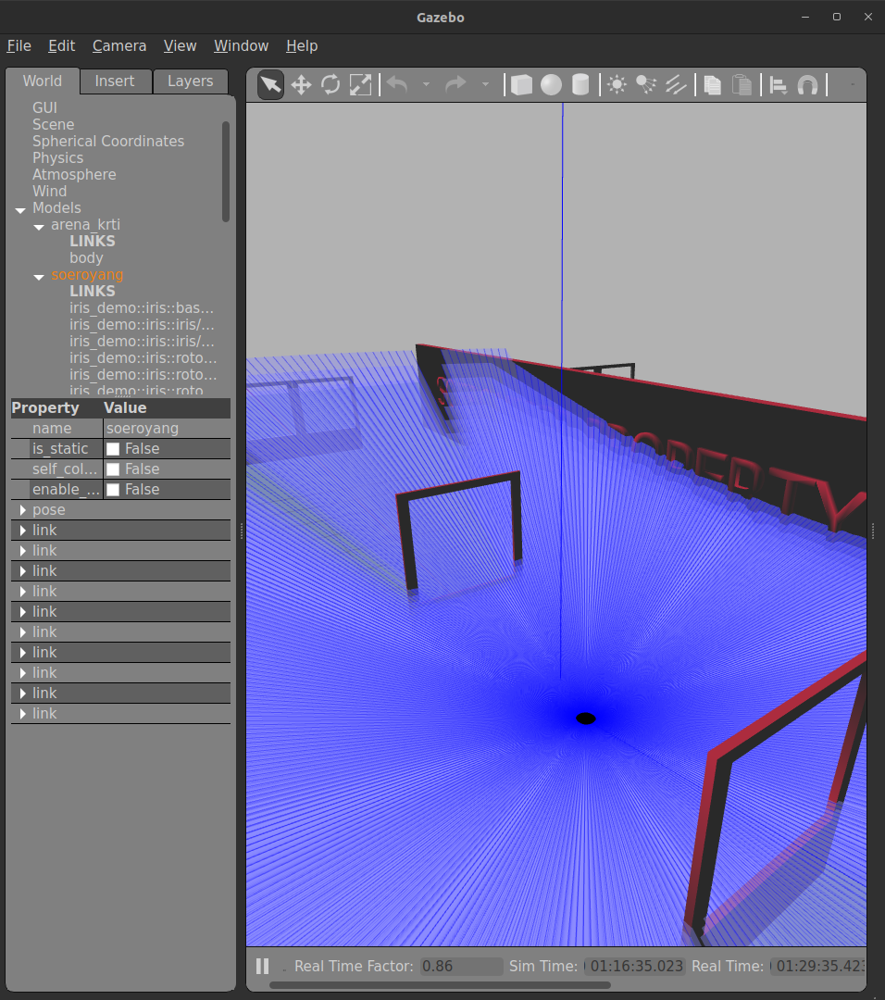
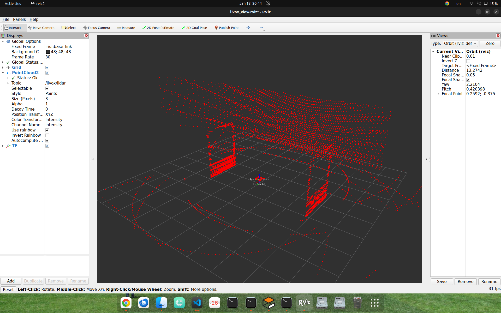

# 2D and 3D Lidar Simulation in Gazebo 11

## Introduction: Basic Theory of 2D and 3D Lidar

Lidar (Light Detection and Ranging) is a remote sensing technology that uses laser light to measure distances to objects and map their surroundings. It works by emitting laser pulses and detecting the time it takes for each pulse to reflect back from surfaces in the environment. This time-of-flight measurement allows lidar sensors to calculate precise distances and generate detailed spatial information.

**2D Lidar** scans a single horizontal plane, producing a two-dimensional map of the environment. It is widely used for applications such as obstacle avoidance, mapping, and navigation in ground robots and drones where only horizontal information is needed.

**3D Lidar** extends this concept by scanning in both horizontal and vertical directions, capturing a full three-dimensional point cloud of the surroundings. This enables advanced perception, mapping, and object detection for autonomous vehicles, drones, and robots that require a comprehensive understanding of their environment.

Both 2D and 3D lidar operate on the same basic principle: emitting laser beams, measuring their reflections, and using this data to reconstruct the shape and position of objects. The main difference lies in the dimensionality and density of the data they provide.

## Lidar Distance Calculation Formula

The distance to an object is calculated using the time-of-flight (ToF) principle:

$$
	ext{Distance} = \frac{c \times t}{2}
$$

Where:
- $c$ = speed of light ($\approx 3 \times 10^8$ m/s)
- $t$ = time taken for the laser pulse to travel to the object and back (in seconds)
- The division by 2 accounts for the round trip (to the object and back).

### Example Calculation
Suppose a lidar sensor measures a round-trip time $t = 20$ nanoseconds ($20 \times 10^{-9}$ s):

$$
	ext{Distance} = \frac{3 \times 10^8 \times 20 \times 10^{-9}}{2} = \frac{6 \times 10^0}{2} = 3\ \text{meters}
$$

So, the object is 3 meters away from the lidar sensor.
this is tutorial how to simulating 2D lidaro in Gazebo <mark>Remember this is only for simulation purpose, if u want to try in the real drone make sure the data is already correct</mark> 

## Step - 1 : Add lidar into your drone, (2D)

Edit file `models/iris_with_ardupilot/model.sdf`: <br> copy paste this plugin, copy paste this plugin into ur iris_with_ardupilot drone model.sdf under <mark> joint name="iris_gimbal_mount" type="revolute" </mark>

### Tested in
<li> Ubuntu 22
<li> ROS-2 Humble
<li> Gazebo Classic

### 2D Lidar RP-Lidar

#### What is 2D Lidar?
2D Lidar is a laser-based sensor that scans its environment in a single horizontal plane, producing a two-dimensional map of distances to surrounding objects. It is commonly used for obstacle detection, mapping, and navigation in robotics.

#### How does it work?
A 2D Lidar emits laser beams in a circular pattern parallel to the ground. It measures the time it takes for each beam to reflect off an object and return, calculating the distance to obstacles in a 2D slice of the environment.

#### Specifications
- **Scan Type:** 2D (single plane)
- **Message Type:** `sensor_msgs/LaserScan`
- **Typical Range:** 0.12 m to 12 m (configurable)
- **Horizontal Resolution:** Up to 360 samples per rotation

#### Compatible 2D Lidars
- RP-Lidar C1
- RP-Lidar A1

2D Lidar is suitable for applications where only horizontal obstacle information is needed, such as ground robots or simple drone collision avoidance.
```xml
     <!-- 2D Lidar sensor -->
    <link name="lidar_link">
      <pose>0 0 0.25 0 0 0</pose>
      <inertial>
        <mass>0.01</mass>
        <inertia>
          <ixx>0.000001</ixx>
          <ixy>0.0</ixy>
          <ixz>0.0</ixz>
          <iyy>0.000001</iyy>
          <iyz>0.0</iyz>  
          <izz>0.000001</izz>
        </inertia>
      </inertial>
      <collision name="lidar_collision">
        <geometry>
          <cylinder>
            <radius>0.05</radius>
            <length>0.07</length>
          </cylinder>
        </geometry>
      </collision>
      <visual name="lidar_visual">
        <geometry>
          <cylinder>
            <radius>0.05</radius>
            <length>0.07</length>
          </cylinder>
        </geometry>
        <material>
          <ambient>0 0 0 1</ambient>
          <diffuse>0 0 0 1</diffuse>
        </material>
      </visual>
      <sensor name="laser" type="ray">
        <pose>0 0 0 0 0 0</pose>
        <ray>
          <scan>
            <horizontal>
              <samples>360</samples>
              <resolution>1</resolution>
              <min_angle>-3.14159</min_angle>
              <max_angle>3.14159</max_angle>
            </horizontal>
          </scan>
          <range>
            <min>0.12</min>
            <max>12.0</max>
            <resolution>0.015</resolution>
          </range>
          <noise>
            <type>gaussian</type>
            <mean>0.0</mean>
            <stddev>0.01</stddev>
          </noise>
        </ray>
        <plugin name="laser_plugin" filename="libgazebo_ros_ray_sensor.so">
          <ros>
            <namespace>/</namespace>
            <remapping>~/out:=scan</remapping>
          </ros>
          <output_type>sensor_msgs/LaserScan</output_type>
          <frame_name>lidar_link</frame_name>
        </plugin>
        <always_on>1</always_on>
        <update_rate>10</update_rate>
        <visualize>true</visualize>
      </sensor>
    </link>

    <joint name="lidar_joint" type="fixed">
      <parent>iris::base_link</parent>
      <child>lidar_link</child>
    </joint>
```


this is 2D lidar visualization must be

2D lidar use /LaserScan massegae type, so its only on 2 Dimensional space
<br> Compatible with
<li> RP-Lidar C1
<li> RP-Lidar A1


### 3D Lidar Velodyne VLP-16
#### What is 3D Lidar?
3D Lidar is a sensor that scans its environment in both horizontal and vertical directions, creating a three-dimensional point cloud of the surroundings. It is widely used for advanced mapping, object detection, and autonomous navigation.

#### How does it work?
3D Lidar uses multiple laser beams or a rotating mechanism to capture distance data in both horizontal and vertical planes. This results in a dense 3D representation (point cloud) of the environment, allowing for more detailed perception compared to 2D Lidar.

#### Specifications
- **Scan Type:** 3D (multiple planes)
- **Message Type:** `sensor_msgs/PointCloud2`
- **Typical Range:** 0.12 m to 12 m (configurable)
- **Horizontal Resolution:** 360 samples per rotation
- **Vertical Resolution:** 16 channels (for VLP-16)

#### Compatible 3D Lidars
- Velodyne VLP-16

3D Lidar is ideal for drones, autonomous vehicles, and robots that require a full 3D understanding of their environment.
```xml
    <link name="lidar_link">
      <pose>0 0 0.25 0 0 0</pose>
      <inertial>
        <mass>0.01</mass>
        <inertia>
          <ixx>0.000001</ixx>
          <ixy>0.0</ixy>
          <ixz>0.0</ixz>
          <iyy>0.000001</iyy>
          <iyz>0.0</iyz>  
          <izz>0.000001</izz>
        </inertia>
      </inertial>
      <collision name="lidar_collision">
        <geometry>
          <cylinder>
            <radius>0.05</radius>
            <length>0.07</length>
          </cylinder>
        </geometry>
      </collision>
      <visual name="lidar_visual">
        <geometry>
          <cylinder>
            <radius>0.05</radius>
            <length>0.07</length>
          </cylinder>
        </geometry>
        <material>
          <ambient>0 0 0 1</ambient>
          <diffuse>0 0 0 1</diffuse>
        </material>
      </visual>
      <sensor name="laser" type="ray">
        <pose>0 0 0 0 0 0</pose>
        <ray>
          <scan>
            <horizontal>
              <samples>360</samples>
              <resolution>1</resolution>
              <min_angle>-3.14159</min_angle>
              <max_angle>3.14159</max_angle>
            </horizontal>
            <vertical>
              <samples>16</samples>
              <resolution>1</resolution>
              <min_angle>-0.2617</min_angle>
              <max_angle>0.2617</max_angle>
            </vertical>
          </scan>
          <range>
            <min>0.12</min>
            <max>12.0</max>
            <resolution>0.015</resolution>
          </range>
          <noise>
            <type>gaussian</type>
            <mean>0.0</mean>
            <stddev>0.01</stddev>
          </noise>
        </ray>
        <plugin name="laser_plugin" filename="libgazebo_ros_ray_sensor.so">
          <ros>
            <namespace>/</namespace>
            <remapping>~/out:=scan</remapping>
          </ros>
          <output_type>sensor_msgs/PointCloud2</output_type>
          <frame_name>lidar_link</frame_name>
        </plugin>
        <always_on>1</always_on>
        <update_rate>10</update_rate>
        <visualize>true</visualize>
      </sensor>
    </link>

    <joint name="lidar_joint" type="fixed">
      <parent>iris::base_link</parent>
      <child>lidar_link</child>
    </joint>
```


Spesification:
<li> Message type : /PointCloud2
<li> Compatible only with Velodyne VLP-16


<br> **Old Plugin ROS1**
- `libgazebo_ros_laser.so` (ROS1 only)
- Parameter `<topicName>` dan `<frameName>` (deprecated)

**Latest Plugin ROS2**
- `libgazebo_ros_ray_sensor.so` (ROS2)
- Parameter `<remapping>~/out:=scan</remapping>` 

# LIVOX Mid-360 Lidar Simulation using Iris Drone Models
## Livox Mid-360 Lidar: How It Works and Specifications

### How It Works
The Livox Mid-360 is a 3D lidar sensor that uses a rotating laser system to scan its environment in a full 360° horizontal field of view and a wide vertical field of view. It emits laser pulses and measures the time it takes for each pulse to return after hitting an object, generating a dense 3D point cloud of the surroundings. The Mid-360 uses a unique non-repetitive scanning pattern, which increases point cloud coverage and reduces blind spots compared to traditional mechanical lidars. This makes it highly effective for mapping, navigation, and obstacle detection in robotics and autonomous vehicles.

### Specifications
- **Type:** 3D lidar (rotating, non-repetitive scan)
- **Horizontal Field of View:** 360°
- **Vertical Field of View:** 62.4° (from -7.22° to +55.22°)
- **Range:** Up to 200 meters
- **Points per Second:** Up to 200,000 pts/s
- **Laser Wavelength:** 905 nm
- **Mass:** 265 g
- **Data Output:** `sensor_msgs/PointCloud2` (in simulation)
- **Typical Applications:** UAVs, autonomous vehicles, robotics, mapping

The Livox Mid-360 is compatible with ROS2 and can be simulated in Gazebo using the provided plugin and configuration. It is suitable for applications requiring high-density, wide-area 3D perception.
```xml
    <!-- ===================================================================== -->
    <!-- LIVOX MID-360 3D LIDAR                                               -->
    <!-- ===================================================================== -->
    <link name="livox_mid360">
      <pose>0 0 0.25 0 0 0</pose>
      <inertial>
        <mass>0.265</mass> <!-- Real MID-360 mass: 265g -->
        <inertia>
          <ixx>0.0001</ixx>
          <ixy>0.0</ixy>
          <ixz>0.0</ixz>
          <iyy>0.0001</iyy>
          <iyz>0.0</iyz>
          <izz>0.0001</izz>
        </inertia>
      </inertial>
      
      <!-- Visual representation -->
      <visual name="livox_visual">
        <geometry>
          <cylinder>
            <radius>0.046</radius> <!-- MID-360 diameter ~92mm -->
            <length>0.072</length> <!-- MID-360 height ~72mm -->
          </cylinder>
        </geometry>
        <material>
          <ambient>0.1 0.1 0.1 1</ambient>
          <diffuse>0.2 0.2 0.2 1</diffuse>
        </material>
      </visual>
      
      <collision name="livox_collision">
        <geometry>
          <cylinder>  
            <radius>0.046</radius>
            <length>0.072</length>
          </cylinder>
        </geometry>
      </collision>

      <!-- Livox MID-360 Sensor -->
      <sensor type="ray" name="livox_mid360_sensor">
        <pose>0 0 0 0 0 0</pose>
        <visualize>true</visualize>
        <update_rate>10</update_rate>
        <always_on>true</always_on>
        
        <plugin name="livox_mid360_plugin" filename="libmid360_plugin.so">
          <ray>
            <scan>
              <horizontal>
                <samples>100</samples>
                <resolution>1</resolution>
                <min_angle>0</min_angle>
                <max_angle>6.28318</max_angle> <!-- 360 degrees -->
              </horizontal>
              <vertical>
                <samples>360</samples>
                <resolution>1</resolution>
                <min_angle>-0.126</min_angle> <!-- -7.22 degrees -->
                <max_angle>0.964</max_angle>  <!-- +55.22 degrees -->
              </vertical>
            </scan>
            <range>
              <min>0.1</min>
              <max>200.0</max> <!-- MID-360 max range: 200m -->
              <resolution>0.002</resolution>
            </range>
            <noise>
              <type>gaussian</type>
              <mean>0.0</mean>
              <stddev>0.01</stddev>
            </noise>
          </ray>
          
          <!-- Livox MID-360 specific parameters -->
          <visualize>false</visualize>
          <samples>20000</samples> <!-- 200,000 points/s @ 10Hz = 20,000 per frame -->
          <downsample>1</downsample>
          <csv_file_name>/home/el-system/ros2_ws/install/mid360_simulation/share/mid360_simulation/scan_mode/mid360.csv</csv_file_name>
          <topic>livox/lidar</topic>
          <frame_name>livox_mid360</frame_name>
        </plugin>
      </sensor>
    </link>

    <!-- Joint: Attach Livox to base_link -->
    <joint name="livox_joint" type="fixed">
      <parent>iris::base_link</parent>
      <child>livox_mid360</child>
    </joint>
```


## How tu Run Livox Simulation
1. Run Gazebo
2. permit bash file <mark>run_all.sh</mark>
```bash
chmod +x run_all.sh
```
3. Run 
```bash
./run_all.sh
```
## Rviz Visualization
RViz2 Setup Instructions:
1. Set 'Fixed Frame' to: iris::base_link
2. Add -> PointCloud2
3. Topic: /livox/lidar
4. Size: 0.05 or bigger
5. Color Transformer: Intensity or AxisColor

**Author:** El Jausyan ~ vtol-Soeromiber  
**Date:** 2026-01-09  
**Status:** TESTED & WORKING
